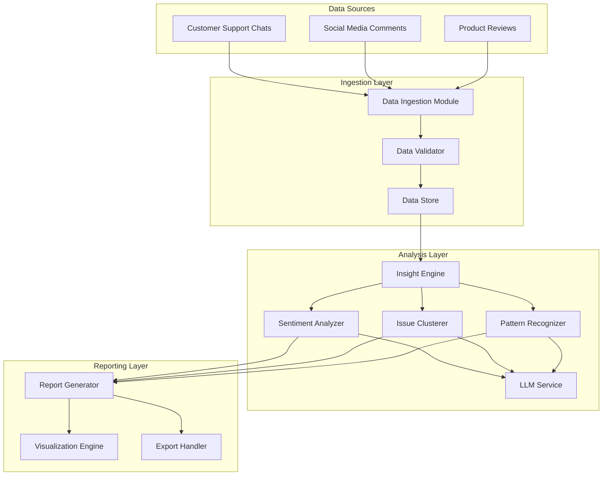

# Design Document: Customer Insights Tool

## Overview

The Customer Insights Tool is an LLM-powered analytics platform that transforms raw customer feedback from multiple sources into actionable business intelligence. The system employs a pipeline architecture that ingests data from customer support chats, social media comments, and product reviews, then applies natural language processing and machine learning techniques to extract sentiment, identify patterns, cluster issues, and generate strategic insights.

The design emphasizes modularity, scalability, and reliability. Each major function (ingestion, analysis, reporting) is isolated into distinct components that can be developed, tested, and scaled independently. The system uses an LLM as the core intelligence layer for semantic understanding while maintaining structured data processing for performance-critical operations.

## Architecture

### High-Level Architecture



### Component Interaction Flow

1. **Ingestion Phase**: Data from multiple sources flows into the Data Ingestion Module, which normalizes formats and validates structure
2. **Storage Phase**: Validated feedback items are stored with metadata in the Data Store
3. **Analysis Phase**: The Insight Engine orchestrates parallel analysis through specialized analyzers (Sentiment, Issue Clustering, Pattern Recognition)
4. **LLM Integration**: Each analyzer makes targeted LLM calls for semantic understanding
5. **Synthesis Phase**: Results from all analyzers are aggregated and synthesized into insights
6. **Reporting Phase**: The Report Generator creates structured reports with visualizations and exports

## Components and Interfaces

### 1. Data Ingestion Module

**Responsibility**: Collect, normalize, and validate feedback from multiple sources

**Interface**:
```typescript
interface DataIngestionModule {
  ingestSupportChats(chats: SupportChat[]): Promise<IngestionResult>
  ingestSocialMedia(comments: SocialMediaComment[]): Promise<IngestionResult>
  ingestProductReviews(reviews: ProductReview[]): Promise<IngestionResult>
  ingestBatch(items: FeedbackItem[]): Promise<IngestionResult>
}

interface IngestionResult {
  successCount: number
  failureCount: number
  errors: IngestionError[]
  processedIds: string[]
}
```

**Key Operations**:
- Parse source-specific formats into unified FeedbackItem structure
- Extract and normalize metadata (timestamps, IDs, context)
- Validate required fields and data quality
- Handle malformed or incomplete data gracefully
- Support batch processing for efficiency

### 2. Data Validator

**Responsibility**: Ensure data quality and completeness before storage

**Interface**:
```typescript
interface DataValidator {
  validate(item: FeedbackItem): ValidationResult
  validateBatch(items: FeedbackItem[]): BatchValidationResult
  detectDuplicates(items: FeedbackItem[]): DuplicateReport
}

interface ValidationResult {
  isValid: boolean
  errors: ValidationError[]
  warnings: ValidationWarning[]
}
```

**Validation Rules**:
- Required fields present (text, timestamp, source)
- Text length within acceptable range (10-10000 characters)
- Timestamp is valid and not in future
- Source type is recognized
- Metadata matches source type requirements

### 3. Data Store

**Responsibility**: Persist feedback items and analysis results

**Interface**:
```typescript
interface DataStore {
  saveFeedbackItem(item: FeedbackItem): Promise<string>
  saveFeedbackBatch(items: FeedbackItem[]): Promise<string[]>
  getFeedbackByTimeWindow(window: TimeWindow): Promise<FeedbackItem[]>
  getFeedbackBySource(source: DataSource): Promise<FeedbackItem[]>
  saveAnalysisResult(result: AnalysisResult): Promise<string>
  getAnalysisResult(id: string): Promise<AnalysisResult>
}
```

**Storage Strategy**:
- Use document-based storage for flexible schema (MongoDB, DynamoDB)
- Index by timestamp, source, and analysis status for efficient queries
- Implement deduplication based on content hash
- Support time-based partitioning for scalability

### 4. Insight Engine

**Responsibility**: Orchestrate analysis pipeline and synthesize insights

**Interface**:
```typescript
interface InsightEngine {
  analyze(config: AnalysisConfig): Promise<AnalysisReport>
  analyzeSentiment(items: FeedbackItem[]): Promise<SentimentAnalysis>
  clusterIssues(items: FeedbackItem[]): Promise<IssueClusters>
  recognizePatterns(items: FeedbackItem[]): Promise<PatternAnalysis>
  generateInsights(analyses: AllAnalyses): Promise<Insight[]>
}

interface AnalysisConfig {
  timeWindow: TimeWindow
  sources: DataSource[]
  minConfidence: number
  focusAreas?: string[]
  customCategories?: string[]
}
```

**Orchestration Logic**:
- Fetch feedback items based on configuration
- Execute sentiment, clustering, and pattern analysis in parallel
- Aggregate results from all analyzers
- Apply confidence scoring and filtering
- Generate prioritized insights with supporting evidence

### 5. Sentiment Analyzer

**Responsibility**: Determine emotional tone of feedback using LLM

**Interface**:
```typescript
interface SentimentAnalyzer {
  analyzeSentiment(item: FeedbackItem): Promise<SentimentResult>
  analyzeBatch(items: FeedbackItem[]): Promise<SentimentResult[]>
  aggregateSentiment(results: SentimentResult[]): SentimentMetrics
  detectSentimentShifts(current: SentimentMetrics, previous: SentimentMetrics): SentimentTrend[]
}

interface SentimentResult {
  feedbackId: string
  sentiment: 'positive' | 'negative' | 'neutral'
  score: number  // -1.0 to 1.0
  confidence: number  // 0.0 to 1.0
  reasoning: string
}
```

**LLM Prompt Strategy**:
```
Analyze the sentiment of the following customer feedback.
Classify as positive, negative, or neutral.
Provide a score from -1.0 (very negative) to 1.0 (very positive).
Include confidence level and brief reasoning.

Feedback: {text}
Source: {source}
Context: {metadata}
```

### 6. Issue Clusterer

**Responsibility**: Group related problems and themes using semantic similarity

**Interface**:
```typescript
interface IssueClusterer {
  clusterIssues(items: FeedbackItem[]): Promise<IssueClusters>
  rankClusters(clusters: IssueCluster[]): IssueCluster[]
  getRepresentativeExamples(cluster: IssueCluster, count: number): FeedbackItem[]
  trackClusterTrends(current: IssueClusters, historical: IssueClusters[]): ClusterTrend[]
}

interface IssueCluster {
  id: string
  theme: string
  description: string
  frequency: number
  percentage: number
  severity: 'high' | 'medium' | 'low'
  examples: FeedbackItem[]
  relatedClusters: string[]
}
```

**Clustering Approach**:
- Use LLM to extract key themes from each feedback item
- Apply semantic similarity (embeddings) to group related themes
- Use hierarchical clustering to identify major and minor issue groups
- Rank by frequency and sentiment severity
- Generate human-readable cluster descriptions using LLM

**LLM Prompt Strategy**:
```
Extract the main issue or theme from this customer feedback.
Provide a concise label (2-5 words) and brief description.

Feedback: {text}

Return:
- Theme: [label]
- Description: [1 sentence]
- Category: [product/service/technical/other]
```

### 7. Pattern Recognizer

**Responsibility**: Identify cross-source patterns and correlations

**Interface**:
```typescript
interface PatternRecognizer {
  recognizePatterns(itemsBySource: Map<DataSource, FeedbackItem[]>): Promise<PatternAnalysis>
  findCrossSourcePatterns(patterns: Pattern[]): CrossSourcePattern[]
  detectDiscrepancies(patterns: Pattern[]): Discrepancy[]
  calculateCorrelations(patterns: Pattern[]): CorrelationMetrics
}

interface Pattern {
  theme: string
  sources: DataSource[]
  frequency: Map<DataSource, number>
  sentiment: Map<DataSource, SentimentMetrics>
  examples: Map<DataSource, FeedbackItem[]>
}

interface CrossSourcePattern {
  pattern: Pattern
  sourceCount: number
  isCritical: boolean
  consistency: number  // 0.0 to 1.0
}
```

**Pattern Detection Logic**:
- Compare issue clusters across different sources
- Identify themes appearing in multiple sources
- Calculate correlation strength based on frequency and sentiment alignment
- Flag critical patterns (appearing in all 3 sources)
- Detect discrepancies where sentiment differs significantly across sources

### 8. LLM Service

**Responsibility**: Provide natural language understanding capabilities

**Interface**:
```typescript
interface LLMService {
  complete(prompt: string, config: LLMConfig): Promise<LLMResponse>
  completeBatch(prompts: string[], config: LLMConfig): Promise<LLMResponse[]>
  embed(text: string): Promise<number[]>
  embedBatch(texts: string[]): Promise<number[][]>
}

interface LLMConfig {
  model: string
  temperature: number
  maxTokens: number
  retryAttempts: number
  timeout: number
}
```

**Implementation Strategy**:
- Support multiple LLM providers (OpenAI, Anthropic, local models)
- Implement retry logic with exponential backoff
- Use batching to optimize API calls
- Cache embeddings for repeated text
- Monitor token usage and costs

### 9. Report Generator

**Responsibility**: Create comprehensive analysis reports with insights

**Interface**:
```typescript
interface ReportGenerator {
  generateReport(analyses: AllAnalyses, config: ReportConfig): Promise<AnalysisReport>
  createExecutiveSummary(insights: Insight[]): ExecutiveSummary
  createDetailedFindings(analyses: AllAnalyses): DetailedFindings
  createRecommendations(insights: Insight[]): Recommendation[]
}

interface AnalysisReport {
  metadata: ReportMetadata
  executiveSummary: ExecutiveSummary
  sentimentAnalysis: SentimentSection
  issueAnalysis: IssueSection
  patternAnalysis: PatternSection
  insights: Insight[]
  recommendations: Recommendation[]
  dataQuality: DataQualityMetrics
}
```

**Report Structure**:
- **Executive Summary**: Top 3-5 insights, key metrics, critical actions
- **Sentiment Analysis**: Overall sentiment, trends, source breakdown
- **Issue Analysis**: Top issues, frequency distribution, severity assessment
- **Pattern Analysis**: Cross-source patterns, correlations, discrepancies
- **Insights**: Prioritized list with confidence scores and evidence
- **Recommendations**: Actionable next steps with expected impact
- **Data Quality**: Coverage, completeness, confidence metrics

### 10. Visualization Engine

**Responsibility**: Generate charts and visual representations of data

**Interface**:
```typescript
interface VisualizationEngine {
  createSentimentTrendChart(data: SentimentMetrics[]): ChartData
  createIssueDistributionChart(clusters: IssueCluster[]): ChartData
  createSourceComparisonChart(patterns: Pattern[]): ChartData
  createTimeSeriesChart(metrics: TimeSeriesData): ChartData
}
```

**Visualization Types**:
- Sentiment trend line charts (over time)
- Issue distribution pie/bar charts
- Source comparison radar charts
- Time series for pattern evolution
- Heatmaps for cross-source correlations

### 11. Export Handler

**Responsibility**: Export reports in multiple formats

**Interface**:
```typescript
interface ExportHandler {
  exportJSON(report: AnalysisReport): string
  exportPDF(report: AnalysisReport): Buffer
  exportHTML(report: AnalysisReport): string
  exportCSV(data: ExportableData): string
}
```

## Data Models

### Core Data Types

```typescript
// Feedback item from any source
interface FeedbackItem {
  id: string
  source: DataSource
  text: string
  timestamp: Date
  metadata: FeedbackMetadata
  processed: boolean
  analysisResults?: AnalysisResults
}

type DataSource = 'support_chat' | 'social_media' | 'product_review'

interface FeedbackMetadata {
  // Common fields
  customerId?: string
  
  // Support chat specific
  agentId?: string
  chatDuration?: number
  resolved?: boolean
  
  // Social media specific
  platform?: string
  userHandle?: string
  postContext?: string
  likes?: number
  shares?: number
  
  // Product review specific
  productId?: string
  rating?: number
  reviewerId?: string
  verifiedPurchase?: boolean
}

// Time window for analysis
interface TimeWindow {
  start: Date
  end: Date
  label: string  // e.g., "Last 7 days", "Q1 2024"
}

// Insight with confidence and evidence
interface Insight {
  id: string
  type: InsightType
  title: string
  description: string
  confidence: number
  priority: 'critical' | 'high' | 'medium' | 'low'
  category: string
  evidence: FeedbackItem[]
  metrics: InsightMetrics
  recommendations: string[]
}

type InsightType = 
  | 'product_improvement'
  | 'customer_service'
  | 'feature_request'
  | 'bug_report'
  | 'opportunity'
  | 'risk'

interface InsightMetrics {
  affectedCustomers: number
  frequency: number
  sentimentImpact: number
  businessValue: 'high' | 'medium' | 'low'
}

// Sentiment metrics
interface SentimentMetrics {
  positive: number
  negative: number
  neutral: number
  averageScore: number
  totalCount: number
  distribution: SentimentDistribution
}

interface SentimentDistribution {
  veryPositive: number  // 0.5 to 1.0
  positive: number      // 0.1 to 0.5
  neutral: number       // -0.1 to 0.1
  negative: number      // -0.5 to -0.1
  veryNegative: number  // -1.0 to -0.5
}

// Data quality metrics
interface DataQualityMetrics {
  totalItems: number
  validItems: number
  invalidItems: number
  duplicates: number
  completeness: number  // 0.0 to 1.0
  coverage: Map<DataSource, number>
  confidenceLevel: 'high' | 'medium' | 'low'
  warnings: string[]
}
```

### Analysis Results

```typescript
interface AllAnalyses {
  sentiment: SentimentAnalysis
  issues: IssueClusters
  patterns: PatternAnalysis
  opportunities: OpportunityAnalysis
}

interface SentimentAnalysis {
  overall: SentimentMetrics
  bySource: Map<DataSource, SentimentMetrics>
  trends: SentimentTrend[]
  shifts: SentimentShift[]
}

interface SentimentTrend {
  timeWindow: TimeWindow
  metrics: SentimentMetrics
  change: number  // percentage change from previous
  direction: 'improving' | 'declining' | 'stable'
}

interface SentimentShift {
  detected: Date
  magnitude: number
  direction: 'positive' | 'negative'
  possibleCauses: string[]
}

interface IssueClusters {
  clusters: IssueCluster[]
  totalIssues: number
  highPriorityClusters: IssueCluster[]
  trends: ClusterTrend[]
}

interface ClusterTrend {
  clusterId: string
  status: 'emerging' | 'stable' | 'resolving'
  changeRate: number
  historicalData: HistoricalClusterData[]
}

interface PatternAnalysis {
  patterns: Pattern[]
  crossSourcePatterns: CrossSourcePattern[]
  discrepancies: Discrepancy[]
  correlations: CorrelationMetrics
}

interface Discrepancy {
  theme: string
  sources: DataSource[]
  sentimentDifference: number
  description: string
  possibleReasons: string[]
}

interface OpportunityAnalysis {
  opportunities: Opportunity[]
  featureRequests: FeatureRequest[]
  strategicThemes: string[]
}

interface Opportunity {
  id: string
  title: string
  description: string
  frequency: number
  sources: DataSource[]
  priority: number
  relatedInsights: string[]
  estimatedImpact: 'high' | 'medium' | 'low'
}

interface FeatureRequest {
  feature: string
  requestCount: number
  sentiment: number
  examples: FeedbackItem[]
  relatedOpportunities: string[]
}
```


## Correctness Properties

*A property is a characteristic or behavior that should hold true across all valid executions of a system—essentially, a formal statement about what the system should do. Properties serve as the bridge between human-readable specifications and machine-verifiable correctness guarantees.*

### Data Ingestion Properties

**Property 1: Multi-source ingestion preserves metadata**
*For any* valid feedback item from any source type (support chat, social media, product review), when ingested, the stored item should contain all source-specific metadata fields required for that source type.
**Validates: Requirements 1.1, 1.2, 1.3**

**Property 2: Invalid items are rejected**
*For any* feedback item missing required fields (text, timestamp, or source), the validation should reject it and prevent storage.
**Validates: Requirements 1.4**

**Property 3: Batch processing is resilient**
*For any* batch of feedback items containing both valid and invalid items, the system should successfully process all valid items and log errors for invalid ones without stopping.
**Validates: Requirements 1.5**

### Sentiment Analysis Properties

**Property 4: All items receive sentiment scores**
*For any* feedback item that is analyzed, the result should include a sentiment classification (positive, negative, or neutral) and a score between -1.0 and 1.0.
**Validates: Requirements 2.1**

**Property 5: Confidence scores are bounded**
*For any* analysis result (sentiment, insight, or cluster), the confidence score should be between 0.0 and 1.0 inclusive.
**Validates: Requirements 2.2, 4.2**

**Property 6: Sentiment aggregation is consistent**
*For any* set of feedback items from a specific source, the aggregate sentiment metrics should accurately reflect the distribution of individual sentiment scores from that source.
**Validates: Requirements 2.3**

**Property 7: Trend detection identifies changes**
*For any* two time windows with sentiment data, if the average sentiment score changes by more than 0.2 (on the -1 to 1 scale), the system should identify and report this as a sentiment trend.
**Validates: Requirements 2.4**

### Issue Clustering Properties

**Property 8: Themes are grouped into clusters**
*For any* set of feedback items, the clustering algorithm should group items with similar themes together, and each cluster should have a descriptive label.
**Validates: Requirements 3.1**

**Property 9: Clusters are ranked by frequency**
*For any* set of issue clusters, they should be ordered such that cluster[i].frequency >= cluster[i+1].frequency for all i.
**Validates: Requirements 3.2**

**Property 10: Clusters have representative examples**
*For any* issue cluster, it should contain at least one feedback item as a representative example.
**Validates: Requirements 3.3**

**Property 11: Cluster trends are tracked**
*For any* issue cluster that exists in both current and historical data, the system should calculate and report whether it is emerging, stable, or resolving.
**Validates: Requirements 3.5**

### Insight Generation Properties

**Property 12: Sufficient data generates insights**
*For any* analysis with at least 100 feedback items, the system should generate at least 3 insights.
**Validates: Requirements 4.1**

**Property 13: Insights are categorized**
*For any* generated insight, it should have a valid category type (product_improvement, customer_service, feature_request, bug_report, opportunity, or risk).
**Validates: Requirements 4.3**

**Property 14: Insights are prioritized**
*For any* set of insights, they should be ordered by priority (critical > high > medium > low), with higher priority insights appearing first.
**Validates: Requirements 4.4**

**Property 15: Insights cite evidence**
*For any* generated insight, it should reference at least one specific feedback item as supporting evidence.
**Validates: Requirements 4.5**

### Cross-Source Pattern Properties

**Property 16: Cross-source patterns are identified**
*For any* theme that appears in feedback from at least two different sources, the system should identify it as a cross-source pattern.
**Validates: Requirements 5.1**

**Property 17: Common themes are detected**
*For any* two data sources with overlapping issue clusters (clusters with similar themes), the system should identify and report the common themes.
**Validates: Requirements 5.2**

**Property 18: Sentiment discrepancies are highlighted**
*For any* theme that appears in multiple sources, if the average sentiment differs by more than 0.4 between sources, the system should flag this as a discrepancy.
**Validates: Requirements 5.3**

**Property 19: Correlation metrics are calculated**
*For any* identified pattern, the system should calculate cross-source correlation metrics indicating how consistently the pattern appears across sources.
**Validates: Requirements 5.4**

### Report Generation Properties

**Property 20: Reports are complete**
*For any* completed analysis, the generated report should contain all required sections: executive summary, sentiment analysis, issue analysis, pattern analysis, insights, recommendations, and data quality metrics.
**Validates: Requirements 6.1, 6.2, 6.4**

**Property 21: Visualizations are generated**
*For any* analysis report, the system should generate visualizations for sentiment trends, issue cluster distribution, and source comparisons.
**Validates: Requirements 6.3**

**Property 22: Export format round-trip**
*For any* analysis report exported to JSON format, parsing the JSON should reconstruct an equivalent report structure with all key data preserved.
**Validates: Requirements 6.5**

### Time-Based Analysis Properties

**Property 23: Time windows are configurable**
*For any* valid time window specification (start date, end date, and label), the system should accept it and filter feedback items to only those within the specified range.
**Validates: Requirements 7.1, 7.4**

**Property 24: Metric changes are detected**
*For any* two time windows with comparable data, if key metrics (sentiment, issue frequency) change significantly, the system should identify and report these changes.
**Validates: Requirements 7.2**

**Property 25: Seasonal patterns are detected**
*For any* set of equivalent time windows (e.g., multiple Q1 periods), if similar patterns appear consistently, the system should identify them as seasonal patterns.
**Validates: Requirements 7.3**

**Property 26: Historical comparisons are provided**
*For any* current time window where historical data exists for a previous equivalent period, the system should provide trend comparisons between the two periods.
**Validates: Requirements 7.5**

### Data Quality Properties

**Property 27: Quality metrics are calculated**
*For any* data source with ingested feedback, the system should calculate and report quality metrics including completeness, validity rate, and duplicate count.
**Validates: Requirements 8.1**

**Property 28: Duplicates are detected**
*For any* set of feedback items containing duplicates (items with identical or highly similar text from the same source), the system should identify and flag them.
**Validates: Requirements 8.3**

**Property 29: Outliers are handled**
*For any* feedback item with extreme characteristics (e.g., text length > 3 standard deviations from mean), the system should identify it as an outlier and handle it appropriately in aggregate calculations.
**Validates: Requirements 8.4**

### Opportunity Identification Properties

**Property 30: Feature requests are identified**
*For any* feedback item containing explicit feature requests or implicit needs, the system should classify it appropriately and include it in opportunity analysis.
**Validates: Requirements 9.1**

**Property 31: Opportunities are ranked**
*For any* set of identified opportunities, they should be ranked by a combination of frequency and positive sentiment association, with higher-ranked opportunities appearing first.
**Validates: Requirements 9.2**

**Property 32: Request types are distinguished**
*For any* identified opportunity, the system should classify whether it originated from explicit feature requests or implicit needs derived from complaints.
**Validates: Requirements 9.3**

**Property 33: Opportunities are grouped thematically**
*For any* set of related opportunities (opportunities addressing similar needs or product areas), the system should group them into strategic themes.
**Validates: Requirements 9.4**

**Property 34: Cross-source opportunities are prioritized**
*For any* opportunity mentioned in multiple data sources, its priority ranking should be higher than opportunities mentioned in only one source.
**Validates: Requirements 9.5**

### Progress Reporting Properties

**Property 35: Progress indicators are provided**
*For any* analysis operation processing more than 1000 items, the system should emit progress updates showing completion percentage at regular intervals.
**Validates: Requirements 10.3**

### Error Handling Properties

**Property 36: LLM failures trigger retries**
*For any* LLM service call that fails, the system should retry up to 3 times with exponential backoff before marking the operation as failed.
**Validates: Requirements 11.1**

**Property 37: Processing continues after errors**
*For any* batch operation where some items fail (due to LLM errors, malformed input, or other issues), the system should continue processing remaining items and log all failures.
**Validates: Requirements 11.2, 11.3**

**Property 38: Partial reports are generated**
*For any* analysis where one or more data sources fail to process, the system should still generate a report containing results from successfully processed sources.
**Validates: Requirements 11.4**

**Property 39: Error messages are informative**
*For any* critical error, the error message should include the error type, context, and troubleshooting guidance.
**Validates: Requirements 11.5**

### Configuration Properties

**Property 40: Custom configurations are applied consistently**
*For any* custom configuration (confidence thresholds, focus areas, sentiment thresholds, custom categories), when set, it should be applied uniformly across all analysis operations in that session.
**Validates: Requirements 12.1, 12.2, 12.3, 12.4, 12.5**

## Error Handling

### Error Categories

1. **Data Ingestion Errors**
   - Malformed input data
   - Missing required fields
   - Invalid data types
   - Duplicate detection

2. **LLM Service Errors**
   - API unavailability
   - Rate limiting
   - Timeout errors
   - Invalid responses

3. **Analysis Errors**
   - Insufficient data volume
   - Clustering failures
   - Pattern recognition failures

4. **System Errors**
   - Memory constraints
   - Storage failures
   - Network issues

### Error Handling Strategies

**Retry Logic**:
- LLM calls: Exponential backoff (1s, 2s, 4s) up to 3 attempts
- Network operations: Linear backoff (2s, 4s, 6s) up to 3 attempts
- Transient failures: Automatic retry
- Permanent failures: Log and continue

**Graceful Degradation**:
- If one data source fails, process others
- If LLM unavailable, use fallback heuristics for basic analysis
- If clustering fails, provide unclustered issue list
- Generate partial reports when complete analysis impossible

**Error Logging**:
- Log level: ERROR for critical failures, WARN for recoverable issues
- Include: timestamp, operation, error type, context, stack trace
- Structured logging for easy parsing and analysis

**User Communication**:
- Clear error messages without technical jargon
- Actionable guidance for resolution
- Indicate what succeeded vs. what failed
- Provide confidence caveats in reports when errors occurred

### Validation Strategy

**Input Validation**:
- Validate all feedback items before processing
- Check required fields, data types, value ranges
- Sanitize text input (remove control characters, normalize whitespace)
- Validate configuration parameters

**Output Validation**:
- Verify LLM responses match expected schema
- Validate confidence scores are in range [0, 1]
- Check sentiment scores are in range [-1, 1]
- Ensure all required report sections are present

**Data Quality Checks**:
- Minimum data volume thresholds
- Duplicate detection and removal
- Outlier identification
- Completeness metrics

## Testing Strategy

### Dual Testing Approach

The system requires both unit tests and property-based tests for comprehensive coverage:

**Unit Tests**: Focus on specific examples, edge cases, and integration points
- Specific data ingestion scenarios (empty text, missing fields)
- Known sentiment examples (clearly positive/negative text)
- Edge cases (single item, empty dataset, all duplicates)
- Error conditions (LLM timeout, invalid JSON)
- Integration between components

**Property-Based Tests**: Verify universal properties across all inputs
- Generate random feedback items and verify ingestion properties
- Generate random sentiment data and verify aggregation properties
- Generate random clusters and verify ranking properties
- Test with randomized configurations
- Minimum 100 iterations per property test

### Property-Based Testing Configuration

**Framework**: Use `fast-check` (TypeScript/JavaScript) or `hypothesis` (Python)

**Test Configuration**:
- Minimum 100 iterations per property test
- Shrinking enabled to find minimal failing cases
- Seed-based reproducibility for debugging
- Timeout: 30 seconds per property test

**Test Tagging**:
Each property test must include a comment tag referencing the design property:
```typescript
// Feature: customer-insights-tool, Property 1: Multi-source ingestion preserves metadata
test('ingestion preserves metadata for all source types', () => {
  fc.assert(fc.property(
    feedbackItemArbitrary,
    (item) => {
      const stored = ingest(item);
      return hasRequiredMetadata(stored, item.source);
    }
  ), { numRuns: 100 });
});
```

### Test Data Generators

**Feedback Item Generators**:
- Random text (10-1000 characters)
- Random timestamps (past 2 years)
- Random source types
- Random metadata appropriate to source
- Controlled duplicates
- Invalid items (missing fields, wrong types)

**Analysis Data Generators**:
- Random sentiment scores (-1.0 to 1.0)
- Random confidence scores (0.0 to 1.0)
- Random issue clusters with varying frequencies
- Random time windows
- Random cross-source patterns

### Integration Testing

**End-to-End Scenarios**:
1. Ingest data from all three sources → Analyze → Generate report → Export
2. Ingest with errors → Verify partial processing → Check error logs
3. Configure custom thresholds → Analyze → Verify thresholds applied
4. Analyze with insufficient data → Verify warnings in report
5. Simulate LLM failures → Verify retries and fallback behavior

**Component Integration**:
- Data Ingestion → Data Store
- Data Store → Insight Engine
- Insight Engine → LLM Service
- All Analyzers → Report Generator
- Report Generator → Export Handler

### Performance Testing

While not part of correctness properties, performance should be validated:
- Load testing with 10K, 50K, 100K items
- Concurrent analysis of multiple sources
- LLM call batching efficiency
- Memory usage profiling
- Response time monitoring

### Test Coverage Goals

- Unit test coverage: >80% of code paths
- Property test coverage: 100% of correctness properties
- Integration test coverage: All major component interactions
- Error path coverage: All error handling branches
- Edge case coverage: All identified edge cases

